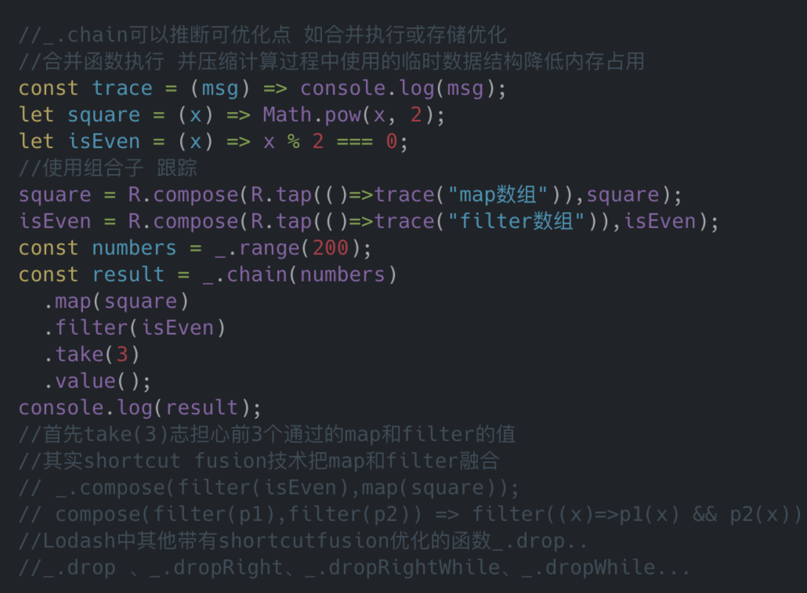
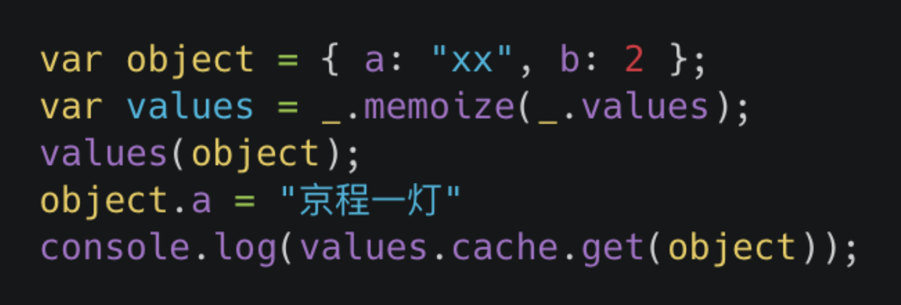
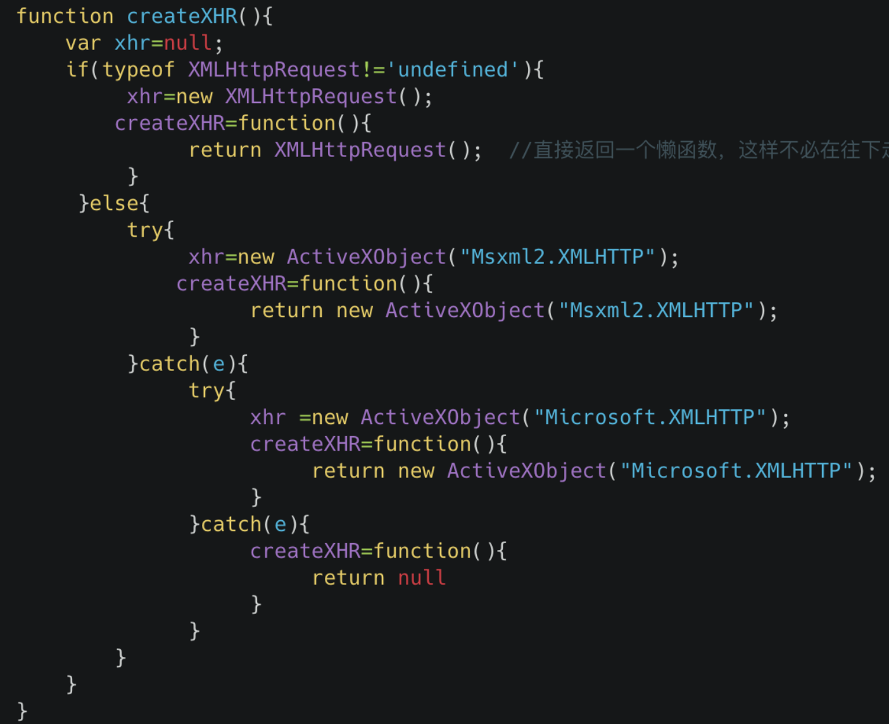

# 惰性链

在 javascript 中，所谓的惰性是指延迟执行的意思。先将需要执行的函数存储起来，在某一个节点需要执行的时候才执行。


在 value 之前都是惰性的，没有调用 value 都不会拿到值。同时 chain 还会自动分析，分析惰性链里面的操作是不是可以融合，该操作称为 shortCut，从而减少内存占用。



**惰性链简单实现**

- 使用了 es6 的...args 来取剩余参数。
- 使用了 array 函数的 reduce 方法。
- 主要原理是，在使用 invoke 调用函数时，实际上没有调用，而是把函数储存在 calls 这个数组里面，等到执行 force 方法的时候，再一个个地调用函数。

```
function lazyChain(fn) {
  var calls = [];
  return {
    invoke: function(funcStr, ...args){
      calls.push(function(target) {
        if(target === undefined) return fn[funcStr](...args);
        return fn[funcStr](target, ...args);
      });
      return this;
    },
    force: function() {
      return calls.reduce((accu, curFunc) => {
        if(accu === undefined) return curFunc();
        return curFunc(accu);
      }, undefined);
    }
  };
}
```

```
const fn1 = {
  hello: function() {
    console.log('hello');
  },
  mark1: function() {
    console.log(',');
  },
  world: function() {
    console.log('world');
  },
  mark2: function() {
    console.log('!');
  }
};

//此时没有任何输出，因为是惰性的。
const words = lazyChain(fn1).invoke('hello').invoke('mark1').invoke('world').invoke('mark2');

//此时输出：hello , world !
words.force();
```

# 惰性求值

> 所谓的惰性求值就是竟可能的推迟求值，直到相关的依赖执行时，才去求值，尽量避免不必要的函数调用。

下面的例子在命令式中顺序是确定的，先执行 s1、s2，然后在 concatenate。但在函数式编程中，可以将 s1、s2 并行执行，并且在执行 concatenate 之前都不去执行 s1、s2，这也是惰性求值

```
String s1 = somewhatLongOperation1();
2
String s2 = somewhatLongOperation2();
3
String s3 = concatenate(s1, s2);
```

下面也是一个惰性求值的例子，首先将求值的函数记忆起来，然后在真正需要值得时候再在去获取值


# 惰性函数

> 写一个函数，这个函数返回首次调用的 date 对象

**写法一**

缺点：每次都要进行一次判断，并且污染全家变量

```
var t;
function foo(){
  if(t) return t;
  t=new Date();
  return t
}
```

**写法二采用闭包**
采用闭包虽然没有污染全局变量，单也要每次进行判断

```
function foo(){
  var t;
  return function(){
    if(t)return t;
    t=new Date()
    return t
  }
}()
```

**写法三函数对象**
利用函数也是个对象这种特质,但这种方法也需要每次判断。函数声明是可以对函数名进行可读可写的。表达式只可读

```

function foo(){
  if(foo.t)return foo.t;
  foo.t=new Date;
  return foo.t
}
```

**运用惰性函数**
当函数第一次执行的时候将调用新函数，并返回值，后续调用仅返回返回值。t 将保存在闭包中。

```
function foo(){
  var t=new Date();
  foo=function(){
    return t
  }
  return foo()
}
```

**惰性函数的其他应用**
DOM 事件添加中，为了浏览器的兼容我们需要进行判断

```
function addEvent (type, el, fn){
  if(window.addEventListner){
    addEvent=function(type,el,fn){
       el.addEventListener(type, fn, false);
    }
  }else if(window.attachEvent){
      addEvent = function (type, el, fn) {
            el.attachEvent('on' + type, fn);
        }
  }
}
addEvent()
```


**总结：所谓的惰性函数就是对函数进行重写，以后调用该函数实际调用的是重写的函数。当我们每次只需进行一次判断的时候，并且接下来的使用方式都不会改变，可以考虑使用懒性函数**

# 参考

https://github.com/mqyqingfeng/Blog/issues/44
